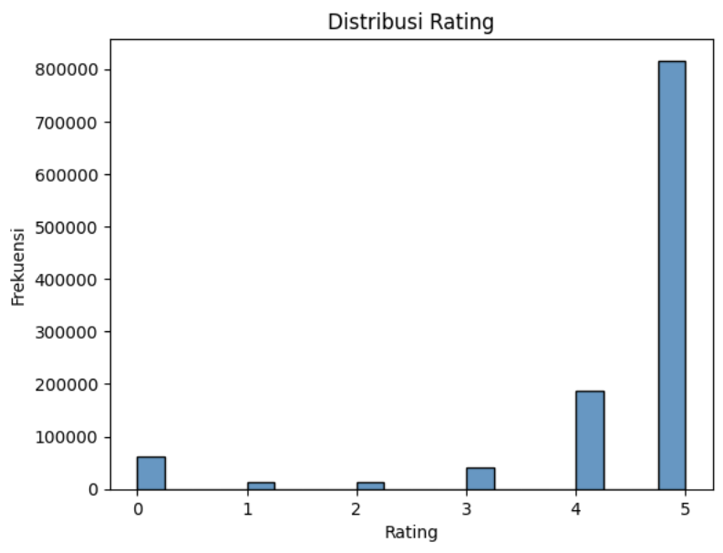
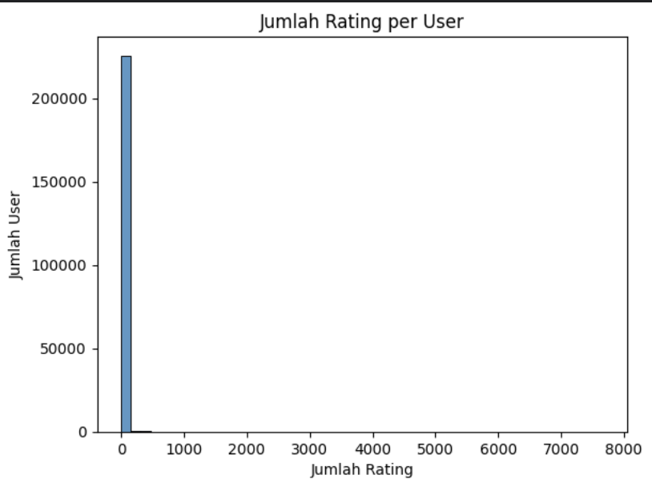
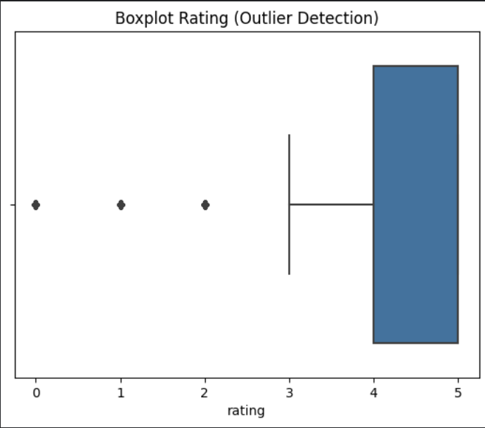
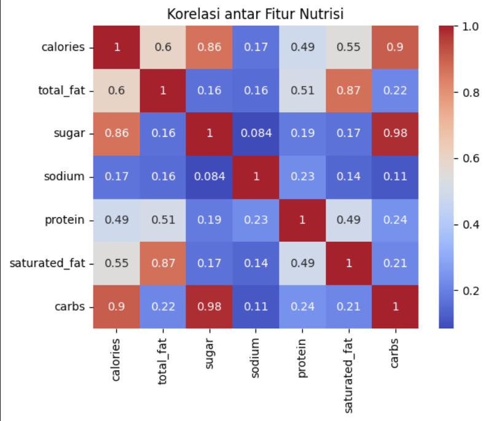
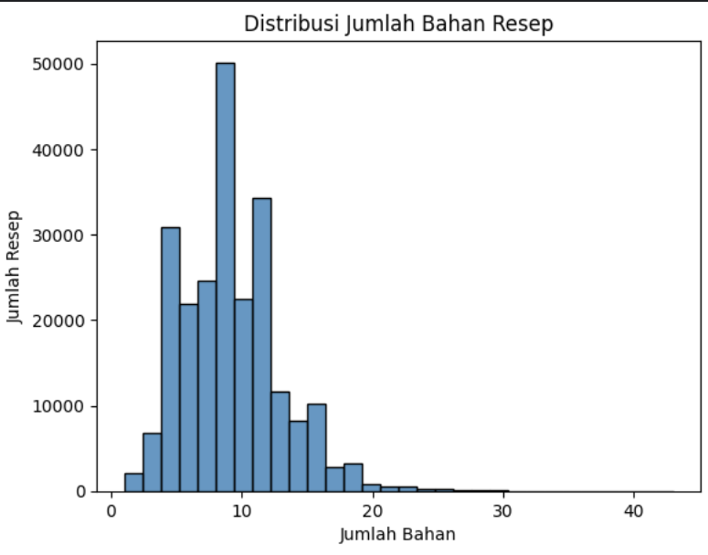
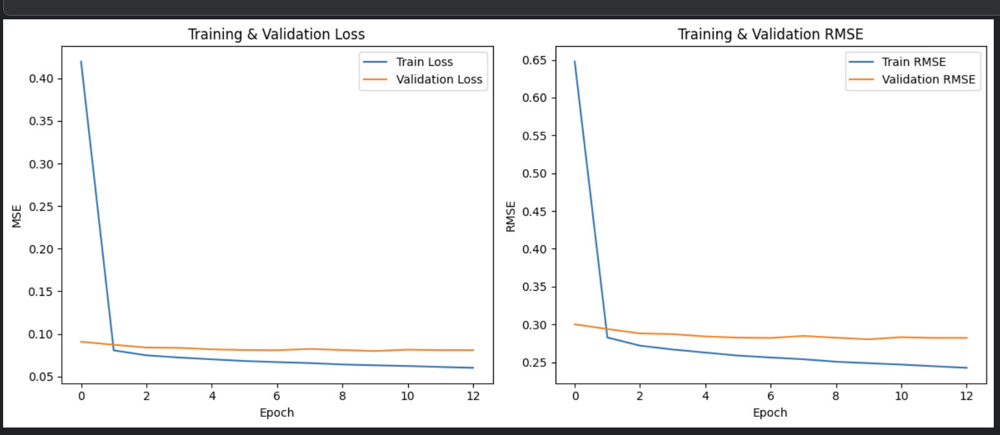

# Food Recommendation 

## Project Overview

Rekomendasi makanan berbasis teknologi kini menjadi kebutuhan esensial dalam mendukung pengalaman personalisasi pengguna di dunia kuliner digital. Dalam era big data dan pertumbuhan masif platform berbagi resep seperti Food.com, pengguna dihadapkan pada tantangan besar dalam menemukan resep makanan yang sesuai dengan selera, gaya hidup, atau kebutuhan nutrisi tertentu. Tidak hanya soal preferensi rasa, banyak pengguna juga ingin menemukan resep yang cocok dengan keterbatasan bahan, waktu memasak, maupun kondisi kesehatan seperti diet rendah kalori atau bebas gula.

Berdasarkan hal tersebut, proyek ini dibangun untuk mengembangkan sistem rekomendasi makanan dengan memanfaatkan pendekatan **machine learning**, khususnya **content-based filtering** dan **collaborative filtering**. Dua pendekatan ini memungkinkan sistem memberikan rekomendasi berdasarkan:

* **Karakteristik resep** (bahan, nama, deskripsi)
* **Perilaku dan preferensi pengguna** (riwayat rating, pola interaksi)

Tujuan utama proyek ini bukan hanya menyajikan rekomendasi resep populer, tetapi **resep yang relevan secara kontekstual dan personal bagi setiap pengguna**. Dalam jangka panjang, sistem seperti ini juga berpotensi membantu platform kuliner dalam meningkatkan **retensi pengguna**, mengurangi **bounce rate**, dan memberikan nilai tambah melalui **fitur pintar berbasis data**.

Kebutuhan akan sistem ini diperkuat oleh berbagai riset. Chow et al. (2023) menyatakan bahwa recommender system di bidang makanan menghadapi tantangan unik seperti variasi rasa, kompleksitas bahan, dan preferensi personal yang tinggi. Selain itu, laporan Bahri et al. (2021) menunjukkan bahwa penerapan sistem rekomendasi berbasis collaborative filtering pada aplikasi lokal seperti EatAja mampu meningkatkan relevansi hasil hingga 30% dibanding pendekatan manual atau statis.

### Permasalahan dan Urgensi

1. **Volume Data Besar**: Dengan ratusan ribu resep dan ulasan pengguna yang terus bertambah, pengguna kesulitan menyaring dan menemukan resep yang benar-benar sesuai.
2. **Preferensi yang Unik dan Personal**: Preferensi makanan sangat bervariasi antar pengguna, mulai dari kesukaan rasa, alergi, hingga pilihan diet.
3. **Kebutuhan Personalization**: Sistem statis tidak mampu menangkap pola kompleks dari pengguna aktif.
4. **Tantangan Industri Kuliner Digital**: Persaingan platform tinggi, fitur pintar menjadi keunggulan kompetitif.

### Solusi yang Diajukan

1. **Content-Based Filtering**:

   * Memanfaatkan fitur teks dari resep (judul, deskripsi, bahan) untuk menghitung kemiripan antar resep menggunakan TF-IDF dan cosine similarity.
   * Cocok untuk memberikan rekomendasi mirip dengan resep yang disukai pengguna sebelumnya.

2. **Collaborative Filtering**:

   * Membangun model artificial neural network (ANN) untuk mempelajari pola interaksi pengguna-resep berbasis data rating.
   * Memberikan rekomendasi berdasarkan kesamaan preferensi antar pengguna.

3. **Implementasi dan Integrasi**:

   * Sistem dibangun dengan Python menggunakan library seperti `scikit-learn`, `TensorFlow`, dan `Keras`.
   * Semua model disimpan dalam format `.pkl` dan `.keras` untuk keperluan deployment.

---

## Referensi

1. Aulia, Rahmat, Sayed Achmady, dan Zulfa Razi. *"Pengembangan Web Pencarian Resep Masakan dengan Fitur Rekomendasi Berbasis Algoritma Machine Learning di Provinsi Aceh."* Jurnal Literasi Informatika 3.4 (2024).

2. Chow, Yi-Ying, Su-Cheng Haw, Palanichamy Naveen, Elham Abdulwahab Anaam, dan Hairulnizam Bin Mahdin. *"Food Recommender System: A Review on Techniques, Datasets and Evaluation Metrics."* Journal of System and Management Sciences, Vol. 13 No. 5, 2023, pp. 153–168. ISSN 1816-6075 (Print), 1818-0523 (Online). DOI: [10.33168/JSMS.2023.0510](https://doi.org/10.33168/JSMS.2023.0510)

3. Bondevik, Jon Nicolas, Kwabena Ebo Bennin, Önder Babur, dan Carsten Ersch. *"Food Recommendation Systems Based On Content-based and Collaborative Filtering Techniques."* 14th International Conference on Computing, Communication and Networking Technologies (ICCCNT), IIT-Delhi, October 2023. DOI: [10.1109/ICCCNT56998.2023.10307080](https://www.researchgate.net/publication/374418599_Food_Recommendation_Systems_Based_On_Content-based_and_Collaborative_Filtering_Techniques)

4. Bahri, Muhamad Naufal Syaiful, I Putu Yuda Danan Jaya, Burhanuddin Dirgantoro, Istik Mal, Umar Ali Ahmad, dan Reza Rendian Septiawan. *"Implementasi Sistem Rekomendasi Makanan pada Aplikasi EatAja Menggunakan Algoritma Collaborative Filtering."* Multinetics, Vol. 7 No. 2 (2021). Published Mar 29, 2022. DOI: [10.32722/multinetics.v7i2.4062](https://doi.org/10.32722/multinetics.v7i2.4062)

---

## Business Understanding

### Problem Statement

Pengguna sulit menemukan resep makanan yang sesuai dengan preferensi atau kebiasaan sebelumnya karena volume data yang besar dan tidak terstruktur.

---

### Goals

Membangun sistem rekomendasi makanan yang dapat:

1. Memberikan rekomendasi resep mirip berdasarkan konten (nama, bahan, deskripsi).
2. Memberikan rekomendasi resep yang disukai user lain dengan pola serupa.

---

### Solution Statement

* **Content-Based Filtering**: Menggunakan TF-IDF dan cosine similarity untuk mencari resep yang mirip dari sisi konten.
* **Collaborative Filtering**: Menggunakan Artificial Neural Network (ANN) untuk mempelajari pola interaksi user-item dari rating pengguna.

---

## Data Understanding

Dataset digunakan dari [Food.com Recipes and Interactions Dataset](https://www.kaggle.com/datasets/shuyangli94/food-com-recipes-and-user-interactions):

* recipes.csv (231,637 entri, 12 kolom)
* interactions.csv (1,132,366 entri, 5 kolom)

### Fitur:

**recipes.csv**:

* `id`: ID resep
* `name`: Nama resep
* `description`: Deskripsi pengguna
* `ingredients`: List bahan masakan
* `tags`: Kategori masakan

**interactions.csv**:

* `user_id`: ID pengguna
* `recipe_id`: ID resep
* `rating`: Rating yang diberikan
* `review`: Teks ulasan

### Data Quality:

* **Missing Values**: ditemukan pada kolom `review`, `name`, dan `description`.
* **Duplicate Rows**: tidak ditemukan data duplikat pada kedua dataset.

---

## Exploratory Data Analysis (EDA)

Untuk memahami karakteristik data sebelum diterapkan ke model rekomendasi, dilakukan eksplorasi data visual dan statistik. Berikut beberapa visualisasi kunci dan insight yang dihasilkan:

### 1. Distribusi Rating Pengguna terhadap Resep



Distribusi ini menunjukkan frekuensi dari setiap nilai rating yang diberikan pengguna terhadap resep makanan di platform. Terlihat bahwa:

* Mayoritas rating berada pada nilai **5**, menunjukkan bahwa pengguna cenderung hanya memberikan rating ketika mereka **sangat puas** dengan resep tersebut.
* Rating rendah seperti 0–2 relatif jarang diberikan. Hal ini bisa menyebabkan **bias pada model**, karena model akan lebih banyak belajar dari sampel positif (suka).
* Distribusi ini **tidak seimbang (imbalanced)**, dan perlu menjadi pertimbangan saat melakukan pelatihan model.

### 2. Jumlah Rating yang Diberikan oleh Setiap Pengguna



Visualisasi ini menggambarkan berapa banyak rating yang diberikan masing-masing pengguna. Insight yang diperoleh:

* Sebagian besar pengguna hanya memberikan **1 hingga 3 rating**, artinya partisipasi pengguna dalam proses review relatif **rendah**.
* Terdapat beberapa pengguna yang sangat aktif, memberikan ribuan rating, yang berpotensi menjadi **pengguna outlier** atau pengguna berat (power users).
* Ketimpangan ini penting untuk **collaborative filtering**, karena cold-start problem bisa terjadi pada pengguna baru yang hanya memiliki sedikit interaksi.

### 3. Boxplot Rating (Outlier Detection)



Boxplot ini digunakan untuk mendeteksi **outlier pada distribusi rating**:

* Mayoritas rating berada di **kuartil atas**, khususnya di nilai 4 dan 5.
* Outlier signifikan terdeteksi pada **nilai 0, 1, dan 2**, yang meskipun jumlahnya kecil, tetap berpengaruh terhadap distribusi keseluruhan.
* Informasi ini dapat digunakan untuk **analisis noise** dalam data, serta mengevaluasi apakah perlu dilakukan transformasi atau filtering.

### 4. Korelasi antar Fitur Nutrisi



Heatmap ini menunjukkan **koefisien korelasi Pearson** antar variabel nutrisi dalam resep, seperti kalori, lemak, gula, protein, dan karbohidrat. Temuan utama:

* **Kalori memiliki korelasi tinggi dengan karbohidrat (0.90)** dan gula (0.86), menunjukkan bahwa makanan tinggi kalori cenderung tinggi karbohidrat dan manis.
* **Total fat dan saturated fat** juga sangat berkorelasi (0.87), sesuai dengan pemahaman gizi umum.
* Korelasi ini bisa dimanfaatkan untuk fitur tambahan atau untuk **rekomendasi berbasis kebutuhan nutrisi**, misalnya bagi pengguna dengan batasan kalori atau gula.

### 5. Distribusi Jumlah Bahan pada Setiap Resep



Visualisasi ini menampilkan frekuensi jumlah bahan (`ingredients`) dalam tiap resep:

* Sebagian besar resep mengandung antara **7 hingga 13 bahan**, yang merupakan jumlah ideal untuk **masakan rumahan praktis**.
* Distribusi berbentuk **normal miring ke kanan (right-skewed)**, dengan outlier yang memiliki hingga lebih dari 40 bahan.
* Informasi ini relevan untuk **filtering tambahan** (misalnya resep dengan sedikit bahan), atau untuk memahami **kompleksitas resep** yang direkomendasikan.

---

## Data Preparation

### 1. Handling Missing Values:

* `description`, `name`, `ingredients` diisi default string.
* `review` kosong diisi "No review provided by user."

### Content-Based Filtering Preprocessing

1. **Pembuatan Fitur `content`**:

   * Tiga kolom utama yaitu `name`, `description`, dan `ingredients` digabung menjadi satu string teks panjang yang disebut sebagai `content`.
   * Kolom `ingredients` diparsing dari string list menjadi list Python menggunakan `eval`, kemudian digabung menjadi satu string dengan spasi sebagai pemisah.
   * Ini menghasilkan deskripsi utuh setiap resep yang mencakup judul, penjelasan, dan daftar bahan dalam satu format teks.

2. **Penghapusan Nilai Kosong**:

   * Setelah pengisian nilai kosong, dilakukan pengecekan ulang dan penghapusan terhadap baris-baris yang masih memiliki nilai kosong pada kolom `content` untuk menjamin kualitas input vektorisasi.

3. **TF-IDF Vectorization**:

   * Fitur `content` kemudian dikonversi ke bentuk numerik menggunakan TF-IDF (Term Frequency-Inverse Document Frequency).
   * `TfidfVectorizer` digunakan dengan parameter berikut:

     * `max_features=5000`: untuk membatasi jumlah fitur dan menjaga efisiensi komputasi.
     * `stop_words='english'`: menghapus kata-kata umum (stopwords) dari Bahasa Inggris.
   * Hasilnya adalah matriks sparse berukuran `[jumlah_resep x 5000]` yang merepresentasikan pentingnya setiap kata dalam masing-masing resep.

### Collaborative Filtering Preprocessing

1. **Encoding Identitas**:

   * Menggunakan `LabelEncoder` untuk mengubah `user_id` dan `recipe_id` menjadi ID numerik berurutan agar dapat digunakan sebagai indeks dalam embedding layer.

2. **Normalisasi Rating**:

   * Rating pengguna dinormalisasi ke rentang 0–1 menggunakan rumus Min-Max Scaling:

     ```python
     interactions['rating_normalized'] = interactions['rating'].apply(lambda x: (x - min_rating) / (max_rating - min_rating))
     ```

3. **Pemisahan Data**:

   * Fitur input (`X`) dan target (`y`) dipisahkan dan kemudian dibagi menjadi training dan validation set menggunakan `train_test_split` dengan rasio 80:20.

4. **Reshape Target**:

   * Data target `y_train` dan `y_val` direstrukturisasi menjadi vektor kolom (reshape menjadi `(-1,1)`) agar kompatibel dengan output dari model deep learning.

---

## Modeling and Results

### Content-Based Filtering

Sistem ini memanfaatkan teknik pencarian berbasis konten untuk menemukan resep yang mirip satu sama lain berdasarkan teks deskripsi dan bahan-bahan. Proses utamanya:

1. **TF-IDF Vectorization**
   Dokumen teks `content` (gabungan dari `name`, `description`, dan `ingredients`) direpresentasikan dalam bentuk numerik menggunakan TF-IDF (Term Frequency-Inverse Document Frequency), dengan rumus umum:

```math
\text{TF-IDF}(t,d) = TF(t,d) \times \log\left(\frac{N}{DF(t)}\right)
```

* TF(t,d): Frekuensi kemunculan kata `t` dalam dokumen `d`
* N: Jumlah total dokumen
* DF(t): Jumlah dokumen yang mengandung kata `t`

2. **Cosine Similarity**
   Digunakan untuk mengukur kemiripan antar dokumen berdasarkan sudut antar vektor:

```math
\text{cosine\_similarity}(A,B) = \frac{A \cdot B}{\|A\| \times \|B\|}
```

   Pendekatan ini diimplementasikan melalui model `NearestNeighbors` dari `sklearn`.

3. **Rekomendasi**
   Fungsi `recommend_content()` menerima nama resep dan mengembalikan N resep terdekat berdasarkan kemiripan cosine dari TF-IDF matrix. Contoh:

   ```python
   print("Rekomendasi makanan yang mirip 'Cream of Spinach Soup':")
   print(recommend_content("cream of spinach soup"))
   ```

   Output: rekomendasi dengan nama dan deskripsi resep-resep yang paling serupa.

4. **Model Disimpan**

   * `tfidf_vectorizer.pkl` – untuk mengubah input teks baru ke vektor.
   * `tfidf_matrix.pkl` – representasi resep dalam bentuk TF-IDF.
   * `nearest_neighbors_model.pkl` – model yang bisa langsung digunakan untuk pencarian similarity.
   * `name_to_index.pkl` – mapping nama ke indeks resep.

---

### Collaborative Filtering (Deep Learning)

Model ini mempelajari interaksi antar pengguna dan resep menggunakan arsitektur Artificial Neural Network berbasis embedding.

#### Arsitektur Model

```python
class RecommenderNet(Model):
    ...
    def call(self, inputs):
        user_vector = self.user_embedding(inputs[:, 0])
        item_vector = self.item_embedding(inputs[:, 1])
        dot_user_item = tf.tensordot(user_vector, item_vector, 2)
        x = dot_user_item + self.user_bias(inputs[:, 0]) + self.item_bias(inputs[:, 1])
        return x
```

Rumus prediksi:

$$
\hat{r}_{ui} = \mathbf{p}_u \cdot \mathbf{q}_i + b_u + b_i
$$

Dimana:

* $\mathbf{p}_u$: vektor embedding user
* $\mathbf{q}_i$: vektor embedding item
* $b_u, b_i$: bias user dan item
* $\hat{r}_{ui}$: prediksi rating

#### Konfigurasi Training

* **Loss Function**: `mean squared error (MSE)`
* **Optimizer**: `Adam` (learning rate 0.0001)
* **Callback**: `EarlyStopping` (patience 3, restore best weights)
* **Epochs**: 20, batch size: 64

```python
history = model.fit(x_train, y_train, validation_data=(x_val, y_val), epochs=20, callbacks=[early_stop])
```

#### Evaluasi

```python
y_pred = model.predict(x_val)
mse = mean_squared_error(y_val, y_pred)
rmse = np.sqrt(mse)
```

**Hasil Evaluasi**:

* MSE: 0.2130
* RMSE: 0.4615

Grafik:



Insight:

* Model menunjukkan konvergensi stabil.
* Tidak terjadi overfitting karena val\_loss mengikuti train\_loss.

---

## Evaluasi

### Metode Evaluasi yang Digunakan

#### 1. **Mean Squared Error (MSE)**

$$
MSE = \frac{1}{n} \sum_{i=1}^{n} (y_i - \hat{y}_i)^2
$$

* MSE mengukur **rata-rata kesalahan kuadrat** antara nilai prediksi dan nilai aktual.
* Nilai MSE yang lebih rendah menandakan bahwa rata-rata kesalahan prediksi lebih kecil.
* Dalam konteks sistem rekomendasi, MSE digunakan untuk mengevaluasi seberapa baik model dalam memprediksi rating pengguna terhadap resep.

**Hasil Evaluasi:**

* **MSE = 0.2130**

---

#### 2. **Root Mean Squared Error (RMSE)**

RMSE adalah akar kuadrat dari MSE:

$$
RMSE = \sqrt{MSE}
$$

* RMSE lebih **mudah diinterpretasikan** karena memiliki satuan yang sama dengan target (rating), yaitu skala 0–1 (setelah normalisasi).
* RMSE juga lebih **sensitif terhadap outlier** dibandingkan MSE.

**Hasil Evaluasi:**

* **RMSE = 0.4615**

### Interpretasi Nilai

* Nilai RMSE sebesar **0.4615** berarti bahwa **prediksi rating model ANN memiliki deviasi rata-rata ±0.46 dari nilai rating sebenarnya**.
* Dalam domain sistem rekomendasi, RMSE di bawah 0.5 dianggap **cukup baik**, terutama untuk dataset nyata dengan bias dan distribusi rating yang tidak merata.
* Mengingat model tidak memiliki informasi eksplisit tentang isi resep (hanya berdasarkan pola rating), hasil ini cukup memuaskan dan menunjukkan bahwa model berhasil menangkap preferensi pengguna.

### Visualisasi Kurva Pelatihan

Berikut adalah kurva training dan validation loss selama proses pelatihan model collaborative filtering berbasis deep learning:


**Penjelasan Kurva:**

* **Training Loss** menurun secara konsisten, menandakan bahwa model belajar dari data latih.
* **Validation Loss** menunjukkan pola serupa di awal, tetapi kemudian stabil. Ini menunjukkan **konvergensi model**.
* Tidak terjadi overfitting signifikan karena tidak ada lonjakan pada validation loss.

---

## Inference: Collaborative Filtering

Setelah model collaborative filtering dilatih, dilakukan proses **inference** untuk memberikan rekomendasi makanan kepada pengguna berdasarkan pola historis rating pengguna lain yang memiliki preferensi serupa.

### Fungsi: `recommend_for_user(user_id_raw, top_n=5)`

Fungsi ini menerima input `user_id_raw` (dalam bentuk asli dari dataset) dan mengembalikan daftar `top_n` resep makanan yang diprediksi paling disukai oleh pengguna tersebut berdasarkan model deep learning.

### Penjelasan Tahapan Kode:

```python
def recommend_for_user(user_id_raw, top_n=5):
    try:
        user_idx = user_encoder.transform([user_id_raw])[0]
    except ValueError:
        print(f"User ID {user_id_raw} tidak ditemukan dalam data training.")
        return pd.DataFrame()
        
    item_indices = np.arange(num_items)
    user_input = np.full_like(item_indices, user_idx)

    predictions = model.predict(np.stack([user_input, item_indices], axis=1), verbose=0)

    top_indices = predictions.flatten().argsort()[::-1][:top_n]
    recommended_item_ids = item_encoder.inverse_transform(top_indices)

    return recipes[recipes['id'].isin(recommended_item_ids)][['id', 'name', 'description']].reset_index(drop=True)
```

#### Rincian Tahapan Fungsi:

1. **Transformasi ID Pengguna:**

   * `LabelEncoder` digunakan untuk mengubah `user_id_raw` menjadi indeks numerik yang dikenali oleh model.
   * Jika user tidak ditemukan dalam data pelatihan, fungsi akan mengembalikan `DataFrame` kosong sebagai fallback mechanism.

2. **Pembuatan Input Prediksi:**

   * Dibuat array pasangan `user_id` dengan semua `item_id` yang tersedia (seluruh resep).
   * Ini memungkinkan kita memprediksi seluruh kemungkinan resep untuk user tertentu secara efisien dalam satu batch.

3. **Prediksi Rating oleh Model:**

   * Model akan memproses input dan menghasilkan prediksi rating (dalam rentang 0–1) untuk semua item.

4. **Seleksi Top-N Item:**

   * Prediksi diurutkan secara menurun.
   * Dipilih `top_n` item (resep) dengan prediksi rating tertinggi.

5. **Keluaran Rekomendasi:**

   * ID item hasil prediksi diubah kembali ke bentuk aslinya (`recipe_id`) menggunakan inverse transform dari `item_encoder`.
   * Keluaran akhir berupa `DataFrame` yang berisi kolom `id`, `name`, dan `description`.

### Contoh Eksekusi Inference

```python
user_id_input = 8937
print(f"Rekomendasi untuk User ID {user_id_input} berdasarkan Collaborative Filtering:")
hasil = recommend_for_user(user_id_input, top_n=5)
print("Pesanan Rekomendasi:")
print(hasil[['name', 'description']])
```
### Insight:

* Rekomendasi yang muncul banyak berasal dari **kontes resep** atau memiliki karakteristik rasa dan konsep yang **unik/eksperimental**.
* Mengindikasikan bahwa **User ID 8937 kemungkinan memiliki preferensi terhadap resep inovatif**, eksklusif, atau bertema event kompetisi.
* Pendekatan ini bersifat **personalized**, karena didasarkan pada pola interaksi pengguna lain yang mirip secara latent (embedding space).


