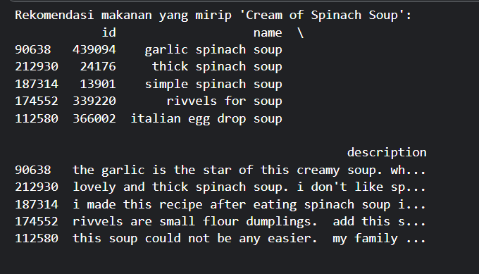
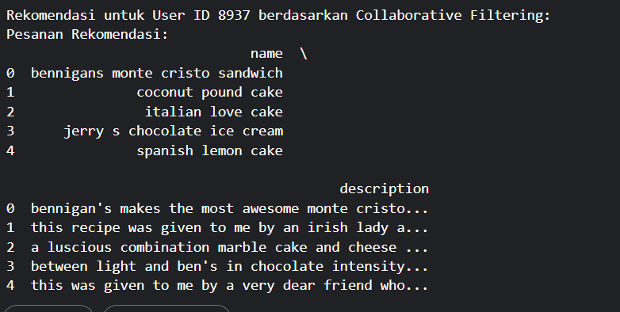
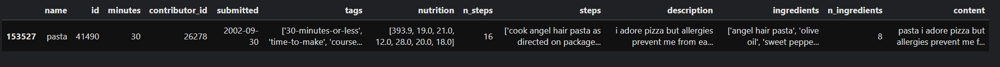
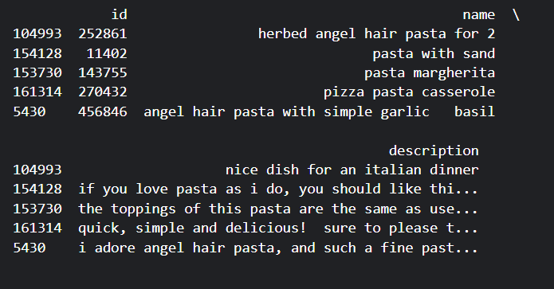

# Food Recommendation 

## Project Overview

Rekomendasi makanan berbasis teknologi kini menjadi kebutuhan esensial dalam mendukung pengalaman personalisasi pengguna di dunia kuliner digital. Dalam era big data dan pertumbuhan masif platform berbagi resep seperti Food.com, pengguna dihadapkan pada tantangan besar dalam menemukan resep makanan yang sesuai dengan selera, gaya hidup, atau kebutuhan nutrisi tertentu. Tidak hanya soal preferensi rasa, banyak pengguna juga ingin menemukan resep yang cocok dengan keterbatasan bahan, waktu memasak, maupun kondisi kesehatan seperti diet rendah kalori atau bebas gula.

Berdasarkan hal tersebut, proyek ini dibangun untuk mengembangkan sistem rekomendasi makanan dengan memanfaatkan pendekatan **machine learning**, khususnya **content-based filtering** dan **collaborative filtering**. Dua pendekatan ini memungkinkan sistem memberikan rekomendasi berdasarkan:

* **Karakteristik resep** (bahan, nama, deskripsi)
* **Perilaku dan preferensi pengguna** (riwayat rating, pola interaksi)

Tujuan utama proyek ini bukan hanya menyajikan rekomendasi resep populer, tetapi **resep yang relevan secara kontekstual dan personal bagi setiap pengguna**. Dalam jangka panjang, sistem seperti ini juga berpotensi membantu platform kuliner dalam meningkatkan **retensi pengguna**, mengurangi **bounce rate**, dan memberikan nilai tambah melalui **fitur pintar berbasis data**.

Kebutuhan akan sistem ini diperkuat oleh berbagai riset. Chow et al. (2023) menyatakan bahwa recommender system di bidang makanan menghadapi tantangan unik seperti variasi rasa, kompleksitas bahan, dan preferensi personal yang tinggi. Selain itu, laporan Bahri et al. (2021) menunjukkan bahwa penerapan sistem rekomendasi berbasis collaborative filtering pada aplikasi lokal seperti EatAja mampu meningkatkan relevansi hasil hingga 30% dibanding pendekatan manual atau statis.

---

## Referensi

1. Aulia, Rahmat, Sayed Achmady, dan Zulfa Razi. *"Pengembangan Web Pencarian Resep Masakan dengan Fitur Rekomendasi Berbasis Algoritma Machine Learning di Provinsi Aceh."* Jurnal Literasi Informatika 3.4 (2024).

2. Chow, Yi-Ying, Su-Cheng Haw, Palanichamy Naveen, Elham Abdulwahab Anaam, dan Hairulnizam Bin Mahdin. *"Food Recommender System: A Review on Techniques, Datasets and Evaluation Metrics."* Journal of System and Management Sciences, Vol. 13 No. 5, 2023, pp. 153–168. ISSN 1816-6075 (Print), 1818-0523 (Online). DOI: [10.33168/JSMS.2023.0510](https://doi.org/10.33168/JSMS.2023.0510)

3. Bondevik, Jon Nicolas, Kwabena Ebo Bennin, Önder Babur, dan Carsten Ersch. *"Food Recommendation Systems Based On Content-based and Collaborative Filtering Techniques."* 14th International Conference on Computing, Communication and Networking Technologies (ICCCNT), IIT-Delhi, October 2023. DOI: [10.1109/ICCCNT56998.2023.10307080](https://www.researchgate.net/publication/374418599_Food_Recommendation_Systems_Based_On_Content-based_and_Collaborative_Filtering_Techniques)

4. Bahri, Muhamad Naufal Syaiful, I Putu Yuda Danan Jaya, Burhanuddin Dirgantoro, Istik Mal, Umar Ali Ahmad, dan Reza Rendian Septiawan. *"Implementasi Sistem Rekomendasi Makanan pada Aplikasi EatAja Menggunakan Algoritma Collaborative Filtering."* Multinetics, Vol. 7 No. 2 (2021). Published Mar 29, 2022. DOI: [10.32722/multinetics.v7i2.4062](https://doi.org/10.32722/multinetics.v7i2.4062)

---

## Business Understanding

### Problem Statement

1. Pengguna kesulitan menemukan resep makanan yang sesuai dengan preferensi atau kebiasaan sebelumnya karena volume data yang besar dan tidak terstruktur.
2. Sistem rekomendasi konvensional belum mampu memahami preferensi personal pengguna secara tepat.

### Goals

1. Memberikan rekomendasi resep mirip berdasarkan konten (nama, bahan, deskripsi).
2. Memberikan rekomendasi resep yang disukai user lain dengan pola serupa.

### Solution Statement

1. **Content-Based Filtering**: Menggunakan TF-IDF dan cosine similarity untuk mencari resep yang mirip dari sisi konten.
2. **Collaborative Filtering**: Menggunakan Artificial Neural Network (ANN) untuk mempelajari pola interaksi user-item dari rating pengguna.

---

## Data Understanding

Dataset digunakan dari [Food.com Recipes and Interactions Dataset](https://www.kaggle.com/datasets/shuyangli94/food-com-recipes-and-user-interactions).

### Dataset Overview

| Dataset                | Jumlah Baris | Jumlah Kolom | Keterangan                                  |
| ---------------------- | ------------ | ------------ | ------------------------------------------- |
| `RAW_recipes.csv`      | 231.637      | 12           | Metadata resep makanan (judul, bahan, dsb)  |
| `RAW_interactions.csv` | 1.132.366    | 5            | Interaksi user-resep berupa rating & ulasan |

### Detail Fitur Setiap Dataset

#### `RAW_recipes.csv` (12 kolom)

| Kolom            | Tipe Data | Deskripsi                                                                           | Missing |
| ---------------- | --------- | ----------------------------------------------------------------------------------- | ------- |
| `name`           | object    | Nama resep makanan                                                                  | 1    |
| `id`             | int       | ID unik resep                                                                       | 0       |
| `minutes`        | int       | Waktu memasak (dalam menit)                                                         | 0       |
| `contributor_id` | int       | ID pengguna yang mengirimkan resep                                                  | 0       |
| `submitted`      | object    | Tanggal pengiriman resep                                                            | 0       |
| `tags`           | object    | Daftar tag/kategori resep (mis. "dessert", "gluten-free")                           | 0       |
| `nutrition`      | object    | List berisi \[kalori, lemak total, gula, sodium, protein, lemak jenuh, karbohidrat] | 0       |
| `n_steps`        | int       | Jumlah langkah memasak                                                              | 0       |
| `steps`          | object    | Daftar instruksi memasak                                                            | 0       |
| `description`    | object    | Deskripsi resep                                                                     | 4979    |
| `ingredients`    | object    | List bahan yang digunakan                                                           | 0       |
| `n_ingredients`  | int       | Jumlah bahan yang digunakan                                                         | 0       |

Kolom yang digunakan untuk content-based filtering adalah: `name`, `description`, `ingredients`.

#### `RAW_interactions.csv` (5 kolom)

| Kolom       | Tipe Data | Deskripsi                         | Missing |
| ----------- | --------- | --------------------------------- | ------- |
| `user_id`   | object    | ID unik pengguna                  | 0       |
| `recipe_id` | int       | ID resep yang diberi rating       | 0       |
| `date`      | object    | Tanggal interaksi                 | 0       |
| `rating`    | int       | Nilai rating yang diberikan (0–5) | 0       |
| `review`    | object    | Teks ulasan pengguna              | 169     |

Kolom yang digunakan untuk collaborative filtering adalah: `user_id`, `recipe_id`, `rating`.

### Data Quality:

* **Missing Values**:

  * `recipes.csv`: Kolom `name` dan `description` mengandung missing values (4979 entri)
  * `interactions.csv`: Kolom `review` memiliki 169 nilai kosong
* **Duplicate Rows**:

  * Tidak ditemukan data duplikat pada kedua dataset

---

## Exploratory Data Analysis (EDA)

Untuk memahami karakteristik data sebelum diterapkan ke model rekomendasi, dilakukan eksplorasi data visual dan statistik. Berikut beberapa visualisasi kunci dan insight yang dihasilkan:

### 1. Distribusi Rating Pengguna terhadap Resep


Distribusi ini menunjukkan frekuensi dari setiap nilai rating yang diberikan pengguna terhadap resep makanan di platform. Terlihat bahwa:

* Mayoritas rating berada pada nilai **5**, menunjukkan bahwa pengguna cenderung hanya memberikan rating ketika mereka **sangat puas** dengan resep tersebut.
* Rating rendah seperti 0–2 relatif jarang diberikan. Hal ini bisa menyebabkan **bias pada model**, karena model akan lebih banyak belajar dari sampel positif (suka).
* Distribusi ini **tidak seimbang (imbalanced)**, dan perlu menjadi pertimbangan saat melakukan pelatihan model.

### 2. Jumlah Rating yang Diberikan oleh Setiap Pengguna


Visualisasi ini menggambarkan berapa banyak rating yang diberikan masing-masing pengguna. Insight yang diperoleh:

* Sebagian besar pengguna hanya memberikan **1 hingga 3 rating**, artinya partisipasi pengguna dalam proses review relatif **rendah**.
* Terdapat beberapa pengguna yang sangat aktif, memberikan ribuan rating, yang berpotensi menjadi **pengguna outlier** atau pengguna berat (power users).
* Ketimpangan ini penting untuk **collaborative filtering**, karena cold-start problem bisa terjadi pada pengguna baru yang hanya memiliki sedikit interaksi.

### 3. Boxplot Rating (Outlier Detection)


Boxplot ini digunakan untuk mendeteksi **outlier pada distribusi rating**:

* Mayoritas rating berada di **kuartil atas**, khususnya di nilai 4 dan 5.
* Outlier signifikan terdeteksi pada **nilai 0, 1, dan 2**, yang meskipun jumlahnya kecil, tetap berpengaruh terhadap distribusi keseluruhan.
* Informasi ini dapat digunakan untuk **analisis noise** dalam data, serta mengevaluasi apakah perlu dilakukan transformasi atau filtering.

### 4. Korelasi antar Fitur Nutrisi


Heatmap ini menunjukkan **koefisien korelasi Pearson** antar variabel nutrisi dalam resep, seperti kalori, lemak, gula, protein, dan karbohidrat. Temuan utama:

* **Kalori memiliki korelasi tinggi dengan karbohidrat (0.90)** dan gula (0.86), menunjukkan bahwa makanan tinggi kalori cenderung tinggi karbohidrat dan manis.
* **Total fat dan saturated fat** juga sangat berkorelasi (0.87), sesuai dengan pemahaman gizi umum.
* Korelasi ini bisa dimanfaatkan untuk fitur tambahan atau untuk **rekomendasi berbasis kebutuhan nutrisi**, misalnya bagi pengguna dengan batasan kalori atau gula.

### 5. Distribusi Jumlah Bahan pada Setiap Resep


Visualisasi ini menampilkan frekuensi jumlah bahan (`ingredients`) dalam tiap resep:

* Sebagian besar resep mengandung antara **7 hingga 13 bahan**, yang merupakan jumlah ideal untuk **masakan rumahan praktis**.
* Distribusi berbentuk **normal miring ke kanan (right-skewed)**, dengan outlier yang memiliki hingga lebih dari 40 bahan.
* Informasi ini relevan untuk **filtering tambahan** (misalnya resep dengan sedikit bahan), atau untuk memahami **kompleksitas resep** yang direkomendasikan.

---

## Data Preparation

### 1. Handling Missing Values:

* `description`, `name`, `ingredients` diisi default string.
* `review` kosong diisi "No review provided by user."

### Content-Based Filtering Preprocessing

1. **Pembuatan Fitur `content`**:

   * Tiga kolom utama yaitu `name`, `description`, dan `ingredients` digabung menjadi satu string teks panjang yang disebut sebagai `content`.
   * Kolom `ingredients` diparsing dari string list menjadi list Python menggunakan `eval`, kemudian digabung menjadi satu string dengan spasi sebagai pemisah.
   * Ini menghasilkan deskripsi utuh setiap resep yang mencakup judul, penjelasan, dan daftar bahan dalam satu format teks.

2. **Penghapusan Nilai Kosong**:

   * Setelah pengisian nilai kosong, dilakukan pengecekan ulang dan penghapusan terhadap baris-baris yang masih memiliki nilai kosong pada kolom `content` untuk menjamin kualitas input vektorisasi.

3. **TF-IDF Vectorization**:

   * Setelah kolom `content` siap, teks tersebut dikonversi menjadi representasi numerik menggunakan TF-IDF (Term Frequency-Inverse Document Frequency).

   * TF-IDF bekerja dengan menghitung bobot kata berdasarkan frekuensi relatifnya dalam dokumen tertentu dibanding seluruh dokumen:

     $TFIDF(t,d) = TF(t,d) \times \log\left(\frac{N}{DF(t)}\right)$

     Dimana:

     * `TF(t,d)`: Frekuensi kata `t` dalam dokumen `d`
     * `N`: Jumlah total dokumen
     * `DF(t)`: Jumlah dokumen yang mengandung kata `t`

   * Dalam implementasi ini digunakan `TfidfVectorizer` dari `sklearn` dengan parameter:

     * `max_features=5000`: membatasi jumlah kata paling informatif agar efisien
     * `stop_words='english'`: menghilangkan kata umum bahasa Inggris

   * Hasil akhirnya adalah **matriks sparse** dengan dimensi `[jumlah resep x 5000]` yang mewakili bobot pentingnya kata-kata dalam masing-masing resep. Matriks ini menjadi input untuk proses content-based filtering menggunakan cosine similarity.

### Collaborative Filtering Preprocessing

1. **Encoding Identitas**:

   * Menggunakan `LabelEncoder` untuk mengubah `user_id` dan `recipe_id` menjadi ID numerik berurutan agar dapat digunakan sebagai indeks dalam embedding layer.

2. **Normalisasi Rating**:

   * Rating pengguna dinormalisasi ke rentang 0–1 menggunakan rumus Min-Max Scaling:

     ```python
     interactions['rating_normalized'] = interactions['rating'].apply(lambda x: (x - min_rating) / (max_rating - min_rating))
     ```

3. **Pemisahan Data**:

   * Fitur input (`X`) dan target (`y`) dipisahkan dan kemudian dibagi menjadi training dan validation set menggunakan `train_test_split` dengan rasio 80:20.

4. **Reshape Target**:

   * Data target `y_train` dan `y_val` direstrukturisasi menjadi vektor kolom (reshape menjadi `(-1,1)`) agar kompatibel dengan output dari model deep learning.

---

## Modeling and Results

### Content-Based Filtering

Sistem ini memanfaatkan pendekatan content-based filtering, yaitu merekomendasikan resep makanan yang mirip berdasarkan kesamaan konten teks antara resep, terutama pada kolom `name`, `description`, dan `ingredients`.

#### 1. Cosine Similarity

Untuk mengukur kemiripan antar resep, digunakan rumus cosine similarity berikut:

```math
\text{cosine\_similarity}(A,B) = \frac{A \cdot B}{\|A\| \times \|B\|}
````

Cosine similarity menghitung sudut antara dua vektor TF-IDF, di mana nilai kemiripan berkisar antara 0 (tidak mirip) hingga 1 (identik). Model `NearestNeighbors` dari `scikit-learn` digunakan untuk mengimplementasikan pendekatan ini.

#### 2. Fungsi Rekomendasi

Setelah vektor TF-IDF terbentuk, fungsi rekomendasi `recommend_content()` dibuat untuk mencari resep yang paling mirip dengan resep input berdasarkan nilai cosine similarity tertinggi.

Contoh implementasi:

```python
def recommend_content(name, top_n=5):
    idx = name_to_index[name]
    distances, indices = nn_model.kneighbors(tfidf_matrix[idx], n_neighbors=top_n + 1)
    indices = indices.flatten()[1:]
    return recipes.iloc[indices][['id', 'name', 'description']]
```

Contoh pemanggilan fungsi:

```python
print("Rekomendasi makanan yang mirip 'Cream of Spinach Soup':")
print(recommend_content("cream of spinach soup"))
```

#### 3. Diagram Arsitektur Inferensi

Berikut adalah ilustrasi proses inferensi pada content-based filtering:



#### 4. Penyimpanan Model

Untuk mempermudah deployment dan pengujian ulang, model disimpan ke dalam file `.pkl`, terdiri dari:

* `tfidf_vectorizer.pkl` – untuk memproses input teks baru
* `tfidf_matrix.pkl` – representasi TF-IDF semua resep
* `nearest_neighbors_model.pkl` – model pencarian kemiripan
* `name_to_index.pkl` – mapping nama resep ke indeks TF-IDF

---

### Collaborative Filtering (Deep Learning)

Model ini menggunakan pendekatan collaborative filtering berbasis neural network, yang mempelajari hubungan antara user dan item (resep) dari interaksi rating pengguna.

#### 1. Arsitektur Model

Model dibangun menggunakan `TensorFlow` dan `Keras`, dengan struktur embedding untuk user dan item. Prediksi rating dilakukan dengan dot product antara embedding user dan item, ditambah bias.

```python
class RecommenderNet(Model):
    ...
    def call(self, inputs):
        user_vector = self.user_embedding(inputs[:, 0])
        item_vector = self.item_embedding(inputs[:, 1])
        dot_user_item = tf.tensordot(user_vector, item_vector, 2)
        x = dot_user_item + self.user_bias(inputs[:, 0]) + self.item_bias(inputs[:, 1])
        return x
```

Rumus prediksi yang digunakan adalah:

```math
\hat{r}_{ui} = \mathbf{p}_u \cdot \mathbf{q}_i + b_u + b_i
```

Dimana:

* \$\mathbf{p}\_u\$: vektor embedding user
* \$\mathbf{q}\_i\$: vektor embedding item
* \$b\_u\$, \$b\_i\$: bias user dan item
* \$\hat{r}\_{ui}\$: prediksi rating user \$u\$ terhadap item \$i\$

#### 2. Konfigurasi Training

* **Loss Function**: `mean_squared_error`
* **Optimizer**: `Adam` dengan learning rate 0.0001
* **Batch Size**: 64
* **Epochs**: 20
* **Callback**: `EarlyStopping` untuk mencegah overfitting

Contoh kode training:

```python
history = model.fit(
    x_train, y_train,
    validation_data=(x_val, y_val),
    epochs=20,
    callbacks=[early_stop]
)
```

#### 3. Inferensi dan Rekomendasi

Setelah model dilatih, prediksi dilakukan dengan memberikan pasangan `[user_id, recipe_id]` dan mengembalikan estimasi rating yang mungkin diberikan user tersebut terhadap resep.

Contoh pengambilan top rekomendasi:

```python
user_id = 8937
recipe_ids = df_recipes['recipe_id'].values
input_pairs = np.array([[user_id, rid] for rid in recipe_ids])
predicted_ratings = model.predict(input_pairs)
top_n = np.argsort(predicted_ratings.flatten())[::-1][:5]
recommended_recipes = df_recipes.iloc[top_n]
print(recommended_recipes[['name', 'description']])
```

#### 4. Diagram Arsitektur Inferensi

Berikut visualisasi alur inferensi collaborative filtering:



#### 5. Penyimpanan Model

Untuk mempermudah deployment dan pengujian ulang, model disimpan ke dalam file `.keras`

```python
model.save("recommendasi_model.keras")
```

---

## Evaluasi

### Metode Evaluasi yang Digunakan

#### 1. Precision@K (Content-Based Filtering)

Untuk sistem rekomendasi berbasis konten, digunakan metrik **Precision@5**, yaitu rasio antara jumlah item yang relevan dibandingkan dengan jumlah item yang direkomendasikan.

$$
\text{Precision@5} = \frac{ \text{Jumlah item relevan yang direkomendasikan} }{ \text{Jumlah total item yang direkomendasikan} }
$$

Evaluasi dilakukan dengan menggunakan resep `"pasta"` sebagai query.

- Sistem mengembalikan 5 resep teratas berdasarkan kemiripan cosine.
- Kelima hasil rekomendasi dinilai masih dalam kategori pasta atau memiliki kedekatan semantik yang tinggi.

**Hasil Precision@5:**  
**5/5 = 1.00 atau 100%**

#### Visualisasi Resep Query:



#### Hasil Rekomendasi dari Model:



---

#### 2. Mean Squared Error (MSE) – Collaborative Filtering

MSE digunakan untuk mengukur selisih rata-rata kuadrat antara nilai rating aktual dengan prediksi model terhadap data validasi.

$$
MSE = \frac{1}{n} \sum_{i=1}^{n} (y_i - \hat{y}_i)^2
$$

**Hasil Evaluasi:**  
MSE = 0.2202

---

#### 3. Root Mean Squared Error (RMSE)

RMSE adalah ukuran kesalahan yang lebih mudah diinterpretasikan karena berada dalam skala yang sama dengan rating aktual.

$$
RMSE = \sqrt{MSE}
$$

**Hasil Evaluasi:**  
RMSE = 0.4692

RMSE ini menunjukkan bahwa prediksi model memiliki deviasi rata-rata sebesar 0.46 terhadap nilai rating aktual (setelah normalisasi).

---

### Visualisasi Kurva Pelatihan


- Kurva menunjukkan penurunan training loss yang konsisten.
- Validation loss stabil, mengindikasikan proses pelatihan yang berjalan baik tanpa overfitting.

---

### Perbandingan Content-Based dan Collaborative Filtering

## Ringkasan Performa Model

| Model                   | Metrik         | Nilai    |
|-------------------------|----------------|----------|
| Content-Based Filtering | Precision@5    | 100%     |
| Collaborative Filtering | RMSE           | 0.4692   |

## Perbandingan Menyeluruh

| Aspek Evaluasi                  | Content-Based Filtering                                       | Collaborative Filtering                                       |
|----------------------------------|---------------------------------------------------------------|---------------------------------------------------------------|
| **Dasar pendekatan**            | Berdasarkan kemiripan teks antar item                         | Berdasarkan pola interaksi user-item                         |
| **Input data utama**            | Kolom teks: `name`, `description`, `ingredients`             | Kolom rating: `user_id`, `recipe_id`, `rating`               |
| **Metrik evaluasi**             | Precision@5: 100%                                             | RMSE: 0.4692                                                  |
| **Kemampuan personalisasi**     | Tidak memperhitungkan preferensi unik per pengguna            | Disesuaikan dengan pola pengguna                             |
| **Kelebihan**                   | Memberikan rekomendasi yang sangat relevan secara semantik    | Menangkap preferensi tersembunyi antar pengguna              |
| **Keterbatasan**                | Tidak responsif terhadap perbedaan selera tiap pengguna       | Tidak dapat menangani item baru tanpa histori interaksi      |
| **Cold start untuk user baru**  | Tidak berlaku (hanya butuh nama resep)                        | Memerlukan histori interaksi minimal                         |
| **Cold start untuk item baru**  | Dapat direkomendasikan berdasarkan konten                     | Tidak dapat direkomendasikan tanpa interaksi sebelumnya      |

---

### Keterkaitan antara Problem Statement, Goals, dan Solusi yang Diberikan

Proyek ini dimulai dengan dua pernyataan masalah utama yang dihadapi oleh pengguna dalam menjelajahi dan menemukan resep makanan yang sesuai. 

1. **Masalah pertama** berkaitan dengan kesulitan pengguna dalam menemukan resep yang relevan dengan preferensi atau kebiasaan mereka, terutama karena volume data resep yang besar dan tidak terstruktur.

2. **Masalah kedua** adalah bahwa sistem rekomendasi konvensional umumnya tidak mampu memahami preferensi pengguna secara personal, sehingga rekomendasi yang dihasilkan kurang tepat sasaran.

---

Untuk menjawab **masalah pertama**, proyek ini menetapkan tujuan untuk membangun sistem **rekomendasi berbasis konten** yang dapat menyarankan resep makanan mirip berdasarkan informasi resep seperti nama, deskripsi, dan bahan-bahan. 

Solusi yang dikembangkan adalah **Content-Based Filtering** menggunakan **TF-IDF** untuk mengubah konten resep menjadi representasi numerik, dan kemudian menggunakan **cosine similarity** untuk mengukur kemiripan antar resep. 

Dengan pendekatan ini, sistem mampu:

- Menemukan resep yang serupa secara semantik
- Memberikan rekomendasi tanpa perlu interaksi pengguna sebelumnya (mengatasi cold-start untuk item)
- Meningkatkan efisiensi eksplorasi katalog resep oleh pengguna

---

Untuk menjawab **masalah kedua**, tujuan yang ditetapkan adalah mengembangkan sistem yang mampu **mempelajari preferensi pengguna berdasarkan interaksi historis**, seperti rating terhadap resep. 

Solusi yang diimplementasikan adalah **Collaborative Filtering** berbasis **deep learning** dengan menggunakan **Artificial Neural Network (ANN)**. 

Model ini bekerja dengan:

- Membangun **embedding** untuk pengguna dan item
- Menggabungkan embedding tersebut dengan **dot product** dan penyesuaian bias
- Memberikan prediksi rating yang mencerminkan preferensi personal pengguna

Dengan demikian, sistem dapat memberikan:

- Rekomendasi yang **terpersonalisasi**
- Kemampuan untuk mengenali pola tersembunyi dari interaksi pengguna lain yang serupa
- Nilai tambah bagi pengguna dalam bentuk pengalaman penggunaan yang lebih relevan dan menarik

Kedua pendekatan ini, content-based dan collaborative filtering, dirancang untuk **menjawab masing-masing pernyataan masalah dan mencapai goals yang ditetapkan**. Content-based filtering menangani masalah ketidakterstrukturan data dan kebutuhan untuk merekomendasikan resep baru, sedangkan collaborative filtering menangani kebutuhan akan personalisasi berbasis interaksi pengguna.
